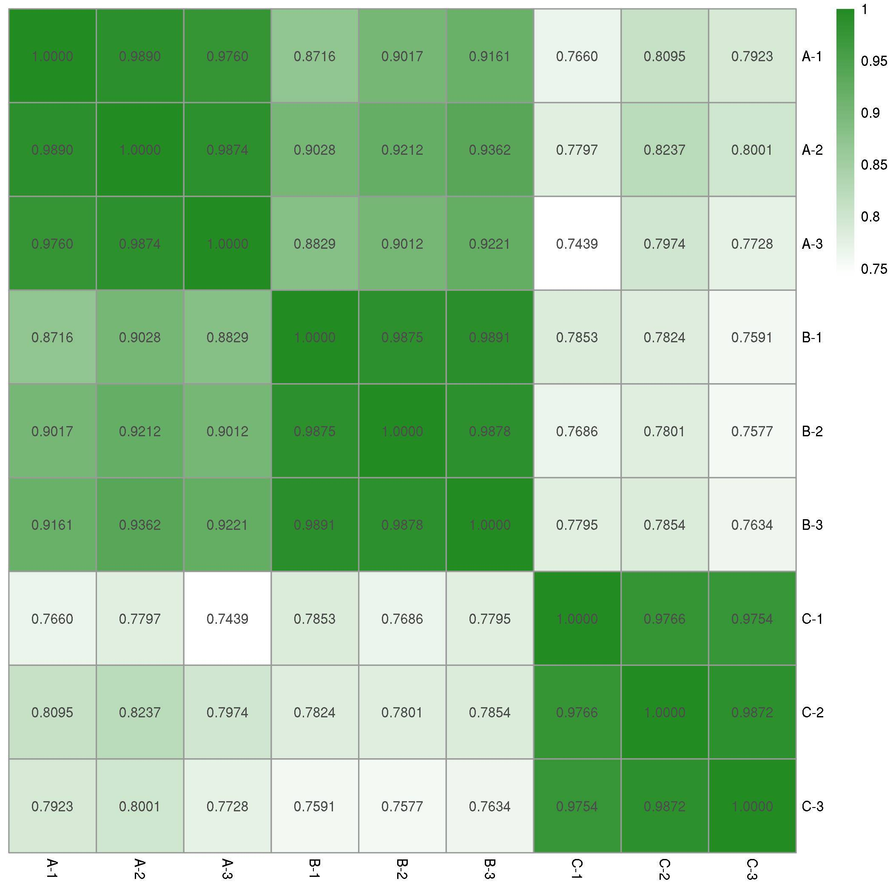
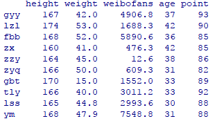
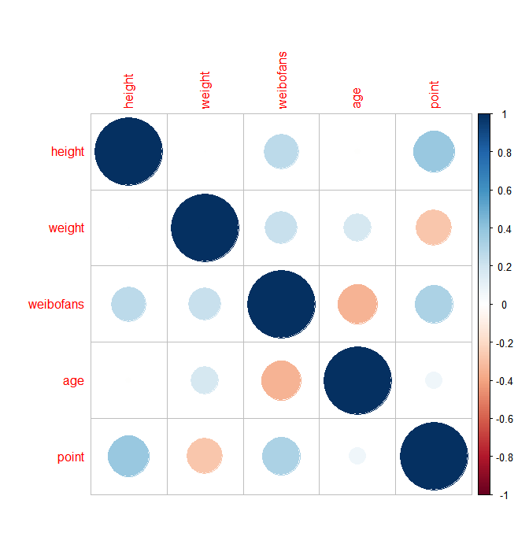
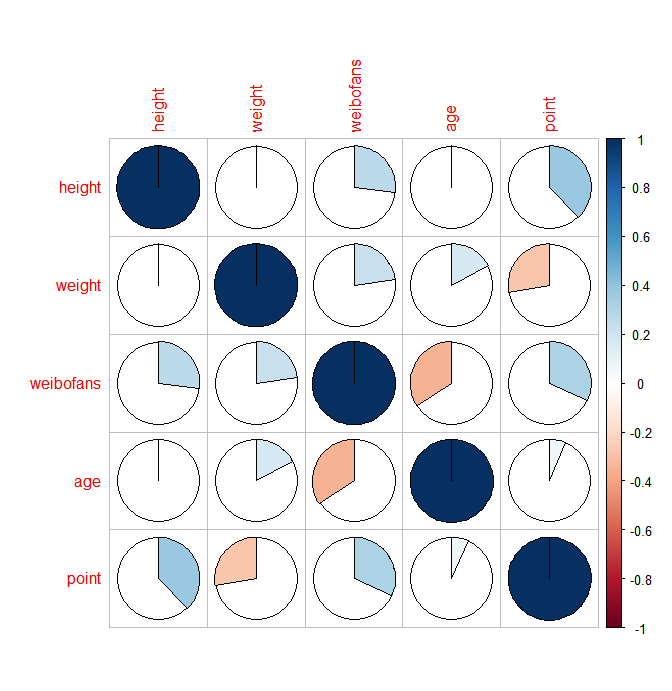
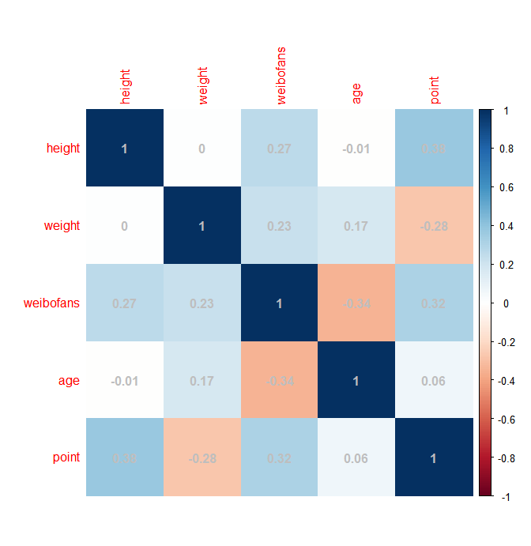
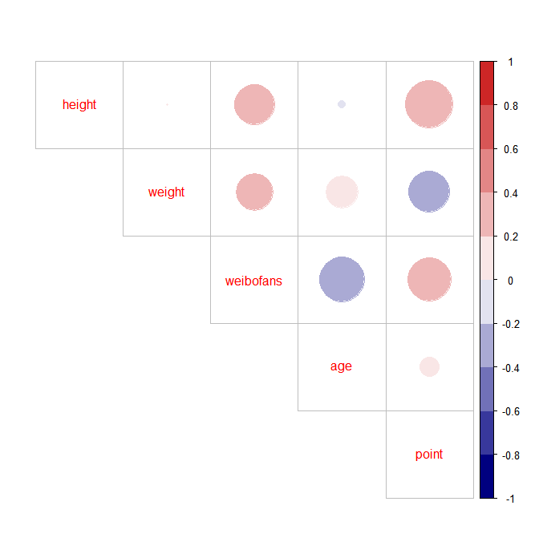

# R语言特征值相关性分析

转载自http://www.sohu.com/a/200219694_278730

接触这么多组学数据，大家肯定做过各种相关性分析。大到几个转录组样本的整体相关性分析，小到挑选了一些候选基因看它们在不同样本中的表达模式相关性。当我们做完了相关性分析的时候，常常会用下面这种图形来展示：




那么问题来了，有没有别的方法，可以让我的相关性分析展现方式更高大上呢？

请出今天的主角，**corrplot程序包**！


老规矩，第一步是安装并调用corrplot：

```R
install.packages("corrplot")
library("corrplot")
```

 第二步，整理数据。今天就拿一些女明星的身高、体重、年龄、微博粉丝与女神指数的数据来分析一下（纯属杜撰）




第三步，我们读取数据，并做相关性分析。

```R
a<-read.table(file=file.choose(),row.names=1,header=T,sep="t")
b<-cor(a)
```

第四步，非常简单，可以直接作图了。

```R
corrplot(b) #这里默认是圆形显示
```



还可以用饼图（pie），颜色（color）等等来显示。

```R
corrplot(b,method="pie")
```



```R
corrplot(b,method="color",addCoef.col="grey") 
#用颜色显示，同时显示相关系数，是不是跟开头绿绿的图一样啦。
```



第五步，是时候展示高端操作了！我们把颜色对调一下，正相关为红色，负相关为海军蓝色，同时把右上角用圆形展示。

```R
col=colorRampPalette(c("navy", "white", "firebrick3")) #设置颜色
corrplot(b,type="upper",col=col(10),tl.pos="d") #tl.pos="d"即不显示周边各列名字
```




